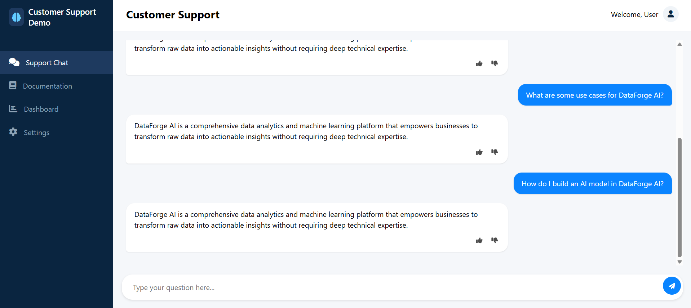

# Customer Support Chatbot

A conversational AI customer support agent for Vahan, an AI-enabled recruitment and staffing platform for blue-collar workers in India. This implementation uses the DeepSeek API via OpenRouter to provide context-aware responses based on a comprehensive knowledge base.

## Features

- **Natural Language Understanding**: Interprets user questions about Vahan using DeepSeek's large language model
- **Knowledge Base Integration**: Provides accurate responses based on comprehensive product documentation
- **Context-Aware Conversations**: Maintains conversation history for more relevant follow-up responses
- **Fallback Mechanism**: Gracefully handles questions outside its knowledge domain
- **User Feedback Collection**: Thumbs up/down ratings to track response quality
- **Analytics Dashboard**: Track query types, satisfaction rates, and fallback frequency
- **Responsive Design**: Works seamlessly on both desktop and mobile devices

## Technology Stack

- **Frontend**: HTML5, CSS3, JavaScript (Vanilla)
- **Backend**: Python, Flask, SQLite
- **AI/LLM**: DeepSeek V3 via OpenRouter API
- **Deployment**: Docker, Docker Compose

## Prerequisites

- [Docker](https://www.docker.com/get-started) and [Docker Compose](https://docs.docker.com/compose/install/)
- [OpenRouter API key](https://openrouter.ai/) for accessing DeepSeek V3

- or you can simply use openai/deepseek api key

## Quick Start

1. **Clone the repository**:
   git clone https://github.com/aravinditte/Customer-Support-Chatbot.git
   cd Customer-Support-Chatbot

2. **Configure environment variables**:
Create a `.env` file in the root directory:
   OPENROUTER_API_KEY=your_openrouter_api_key_here
   SECRET_KEY=your_random_secret_key_here  //you can keep this blank

3. **Start the application**:
   docker-compose build
   docker-compose up

4. **Access the chatbot**:
Open your browser and navigate to `http://localhost`

## Sample Questions to Ask the Chatbot

Here are some example questions you can ask the Vahan support chatbot:

### About the Company
- "What is Vahan and what does it do?"
- "When was Vahan founded?"
- "Where is Vahan headquartered?"
- "How much funding has Vahan raised?"
- "How many workers has Vahan placed in jobs?"

### Recruitment Services
- "How does Vahan's recruitment process work?"
- "What types of workers does Vahan help recruit?"
- "How many placements does Vahan process per month?"
- "What is the average fulfillment time for hiring requests?"
- "How does Vahan source candidates?"

### Technology
- "How does Vahan use AI in its recruitment process?"
- "What kind of chatbot technology does Vahan use?"
- "How does Vahan match candidates with jobs?"
- "What makes Vahan's technology different from traditional recruitment?"
- "Does Vahan use machine learning to improve its services?"

### Programs
- "What is the Mitra program?"
- "How does the Mitra Leader program work?"
- "What benefits do job seekers get from the Mitra app?"
- "Which companies hire through the Mitra program?"
- "How can I become a Mitra Leader?"

### Partnerships
- "Which companies partner with Vahan?"
- "Does Vahan work with Zomato and Swiggy?"
- "What is Vahan's partnership with Airtel?"
- "How many gig economy companies work with Vahan?"
- "Does Vahan partner with training institutes?"

### Business Inquiries
- "How can my company work with Vahan for recruitment?"
- "What is the difference between workforce recruitment and workforce staffing?"
- "Can Vahan handle high-volume hiring needs?"
- "Does Vahan offer payroll management services?"
- "What are the benefits of using Vahan compared to traditional recruitment?"

## Configuration Options

### OpenRouter API Configuration

The application uses OpenRouter to access the DeepSeek V3 language model. You can modify the model settings in `app.py`:
   completion = client.chat.completions.create(
   extra_headers={
   "HTTP-Referer": "https://vahan.co",
   "X-Title": "Vahan Support"
   },
   model="deepseek/deepseek-v3-base:free",
   messages=messages,
   max_tokens=500,
   temperature=0.7
   )

### Knowledge Base Customization

Add or modify Markdown files in the `backend/knowledge_base/` directory to expand the chatbot's knowledge. The system automatically loads all `.md` files in this directory.

## Implementation Details

### Conversation Context Management

The application uses Flask sessions to maintain conversation history between the user and the chatbot. This allows for more natural and contextual interactions:

   Add query to conversation history
   session['conversation'].append({"type": "user", "content": query})

   Limit conversation history to last 10 messages
   if len(session['conversation']) > 10:
   session['conversation'] = session['conversation'][-10:]

### Analytics Tracking

User interactions and feedback are stored in an SQLite database for performance analysis:

   Track analytics
      conn = get_db_connection()
      cursor = conn.cursor()
      cursor.execute(
      "INSERT INTO chat_analytics (session_id, query, response, category, is_fallback) VALUES (?, ?, ?, ?, ?)",
      (session_id, query, response, category, is_fallback)
      )

## Alternative LLM Providers

This implementation uses DeepSeek V3 via OpenRouter, but you can easily switch to other LLM providers:

- **OpenAI**: Update the base URL and API key to use OpenAI's API directly
- **DeepSeek Direct**: Use DeepSeek's API directly if you have access
- **Other Providers**: The code can be adapted to work with any LLM provider that offers a compatible API

## Troubleshooting

### API Connection Issues

If you encounter problems connecting to the OpenRouter API:

1. Verify your API key is correct in the `.env` file
2. Check if you've reached your API usage limits
3. Look for detailed error messages in the backend logs

### Missing Knowledge Base Content

If the chatbot fails to answer questions about Vahan:

1. Ensure the `knowledge_base` directory contains Markdown files
2. Verify the content of these files is relevant to the questions being asked
3. Add more detailed documentation files covering specific topics

## License

MIT License

## Credits

This project was created as a demonstration of AI-powered customer support for [Vahan.co](https://vahan.co/)

